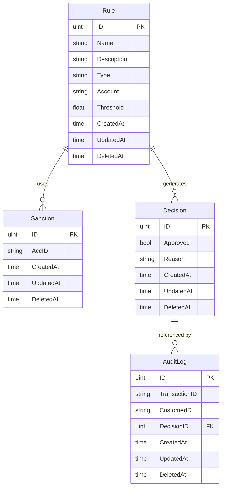

# MS4 – Compliance & Risk Service (golang, MySQL)

This is an example microservice for compliance & risk checks using Gin and GORM.

## Run

1. Copy `.env.example` to `.env` and edit values.
2. `docker-compose up --build`
3. The service will be available at `http://localhost:8080/api/v1`.

## Endpoints

- `POST /api/v1/validateTransaction` - validate a transaction
- `POST /api/v1/rules` - create a compliance rule
- `GET /api/v1/rules` - list rules

## ER Diagram

