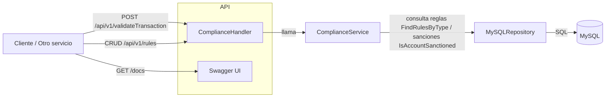

## Informe: Microservicio MS4 — Compliance & Risk Service

Este documento resume el propósito, arquitectura, implementación y uso del microservicio 4 (`cloud-computing-project-ms-4`). Está escrito en castellano y contiene un diagrama en Mermaid que explica la API y el flujo interno.

## Propósito

MS4 es el servicio de cumplimiento (Compliance & Risk) encargado de aplicar reglas (reglas de negocio / políticas de riesgo) sobre transacciones y mantener reglas configurables en la base de datos. Sus responsabilidades principales son:

- Validar transacciones entrantes y devolver una decisión (aprobada / rechazada) con motivo.
- CRUD (crear, leer, listar, actualizar, eliminar) de reglas de cumplimiento almacenadas en MySQL.
- Exponer documentación Swagger para explorar la API.

El servicio se utiliza como un punto central de decisión antes de procesar o autorizar transacciones en otros componentes del sistema.

## Tecnologías y dependencias

- Lenguaje: Go (módulo `github.com/warleon/ms4-compliance-service`).
- Framework HTTP: Gin (router y middleware).
- ORM: GORM para acceso a MySQL.
- Documentación: Swag / Swagger (`swaggo/gin-swagger`).
- Configuración: variables de entorno (soporta `.env` vía `github.com/joho/godotenv`).
- Logging: Logrus.

## Estructura relevante (archivos clave)

- `internal/main.go` — punto de entrada: carga configuración, inicializa DB y rutas, registra handlers y Swagger.
- `internal/handlers/compliance.go` — handlers HTTP (endpoints): `ValidateTransaction` y CRUD de `rules`.
- `internal/service/compliance.go` — lógica de negocio: evaluación de reglas y orquestación de consultas al repositorio.
- `internal/repository/mysql_repository.go` — implementación del repositorio contra MySQL (CRUD de reglas, consultas por tipo de regla, comprobación de listas de sanciones, audit logs).
- `internal/repository/rules/` — modelos y tipos de reglas (p. ej. `AmountThresholdRule`, `Sanction/Blacklist` y base de reglas).

## Endpoints expuestos

- POST /api/v1/validateTransaction

  - Entrada: payload JSON con datos de la transacción (`dto.Transaction`).
  - Salida: `Decision` (aprobada / no aprobada y razón).

- POST /api/v1/rules
- GET /api/v1/rules
- GET /api/v1/rules/:id
- PUT /api/v1/rules/:id
- DELETE /api/v1/rules/:id

- GET /docs/\*any — Swagger UI

Nota: la API está montada bajo el prefijo `/api/v1` (ver `internal/main.go`).

## Diagrama (Mermaid)

El siguiente diagrama muestra el flujo desde el cliente hasta la base de datos y dónde intervienen los distintos componentes:



## Cómo funciona (flujo de `ValidateTransaction`)

1. El handler `ValidateTransaction` hace binding del JSON entrante a `dto.Transaction` y delega a `service.ValidateTransaction`.
2. El servicio consulta al repositorio las reglas del tipo `AmountThreshold` (`FindRulesByType`).
3. Cada regla de tipo umbral se convierte en una implementación concreta (`AmountThresholdRule`) y se valida contra la transacción. Si alguna regla niega la transacción, se devuelve una `Decision` negativa inmediatamente.
4. Si pasa los umbrales, el servicio consulta si la cuenta origen o destino está sancionada (`IsAccountSanctioned`). Si alguna lo está, devuelve `Decision{Approved:false}` con motivo.
5. Si todas las comprobaciones pasan, devuelve `Decision{Approved:true, Reason:"OK"}`.

## Modelos y DTOs (resumen)

Basado en el código disponible, las estructuras principales son:

- `dto.Transaction` — (campos inferidos por uso en el código):

  - `FromAcc` (string) — cuenta origen
  - `ToAcc` (string) — cuenta destino
  - `Amount` (número) — importe de la transacción
  - (puede contener más campos como `Currency`, `TxnID`, `Timestamp`)

- `rules.Rule` — modelo persistente con campos comunes (ID, Type, metadata, opcional `Threshold` para reglas de cantidad, etc.).
- `rules.Decision` — resultado de la evaluación: `{ Approved bool, Reason string }`.

Nota sobre suposiciones: el código fuente utilizado muestra acceso a `FromAcc`, `ToAcc` y `Amount`. No se han modificado definiciones originales; si necesita campos exactos, se puede abrir `internal/dto/transaction.go`.

## Persistencia y migraciones

- El servicio usa GORM y ejecuta `db.AutoMigrate(...)` sobre las tablas listadas en `repository.RepositoryTables` y `rules.RuleTables` al inicio (`internal/main.go`).
- Tablas principales: reglas (`rules.Rule`), sanciones (`rules.Sanction`), y `AuditLog`.

## Consideraciones de diseño y casos borde

- Las reglas se evalúan en un orden lógico: primero umbrales, luego sanciones. Esto permite cortar temprano cuando una regla niega.
- Las reglas mal formadas (p. ej. sin `Threshold`) se ignoran en tiempo de evaluación.
- La comprobación de sanciones está delegada al repositorio para aprovechar índices y consultas directas en la tabla de sanciones.
- Errores del repositorio devuelven 500 al cliente; se podría enriquecer con códigos y trazabilidad.

Casos borde a considerar para producción:

- Transacciones muy grandes / concurrentes → revisar locks y consultas optimizadas en `IsAccountSanctioned`.
- Latencia en DB → aplicar cache para listas de sanciones o usar un servicio de cache/fast lookup.
- Gestión de versiones de reglas → añadir versionado o fecha de vigencia en `rules.Rule`.

## Cómo ejecutar localmente (resumen)

1. Copiar ejemplo de variables de entorno en la carpeta del servicio:

```powershell
Copy-Item .env.example .env
```

2. Ejecutar con Go (desde `cloud-computing-project-ms-4`):

```powershell
go run ./internal
```

3. Alternativamente, usar Docker Compose desde el root del repo para levantar MS4 y su DB (si el `docker-compose.yaml` está configurado):

```powershell
docker-compose up --build --profile ms4
```

4. Acceder a Swagger UI en `http://localhost:<PORT>/docs` y a la API en `http://localhost:<PORT>/api/v1`.

## Observaciones finales y próximos pasos recomendados

- Añadir tests unitarios para `service.ValidateTransaction` (happy path + fallos: umbral, sanción).
- Añadir métricas y trazas distribuidas (OpenTelemetry) para medir latencias de evaluación de reglas.
- Considerar endpoints para recargar reglas en memoria (si se introduce caching) y control de versiones para reglas.

---

Archivo generado automáticamente: `informe.md` — resumen del microservicio MS4.
